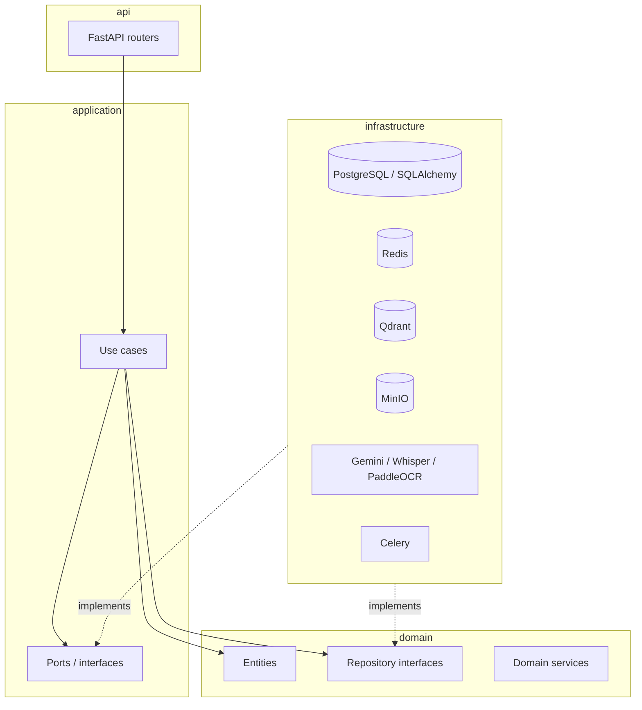

# DrAssist — Architecture

This document describes the structural decisions behind the scaffold. It
does not describe product features — none are implemented yet.

## Guiding principle: Clean Architecture

The backend (`backend/app/`) is organized in concentric layers. Dependencies
only ever point inward; outer layers know about inner layers, never the
reverse.

| Layer | Path | Depends on | Contains |
|---|---|---|---|
| Domain | `app/domain/` | nothing (framework-free) | Entities, value objects, repository *interfaces*, domain services |
| Application | `app/application/` | Domain | Use cases (orchestration), DTOs, port interfaces for external capabilities |
| Infrastructure | `app/infrastructure/` | Application, Domain | Concrete adapters: SQLAlchemy models/repositories, Redis, Qdrant, MinIO, Celery, AI clients |
| API | `app/api/` | Application | FastAPI routers and request/response wiring (currently empty — no endpoints defined) |
| Core | `app/core/` | nothing | Settings, logging, exceptions, security primitives — used by every layer |
| Middlewares | `app/middlewares/` | Core | Cross-cutting HTTP concerns (request ID, logging, error translation) |

**Why this shape:** business rules in `domain/` and orchestration in
`application/` never import FastAPI, SQLAlchemy, or any SDK. That means the
core of the application can be unit-tested without a database, a running
API server, or network access, and any outer-layer technology (swap
Postgres for something else, swap Gemini for another provider) can change
without touching `domain/` or `application/`.

## Frontend module boundaries

The frontend (`frontend/src/`) separates:

- `app/` — Next.js App Router routes/layouts only (no business logic).
- `components/ui/` — generated shadcn/ui primitives (treated as
  library code — regenerate via the shadcn CLI rather than hand-editing).
- `components/layout/`, `components/shared/` — composed, reusable
  components that are not tied to one feature.
- `features/` — vertical slices; each feature owns its components, hooks,
  and API calls once implemented. Nothing is implemented yet.
- `lib/` — framework-agnostic utilities (`cn`, the generic `apiFetch`
  transport). Contains no endpoint-specific calls.
- `config/` — typed environment access and site metadata.

## What is deliberately not implemented

Per the project's current phase, this scaffold contains **no**:

- API endpoints (the v1 router exists and is empty — see
  `backend/app/api/v1/router.py`)
- Business/domain logic
- AI prompts or generation pipelines (AI clients expose method
  signatures only, each raising `NotImplementedError`)

These are expected to be added incrementally on top of this foundation.
