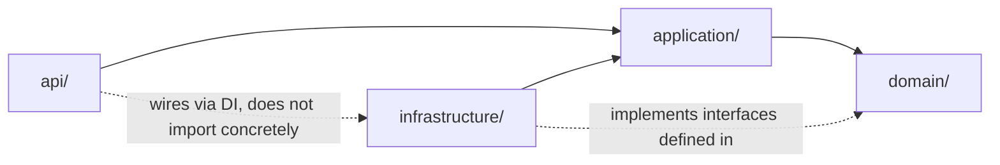
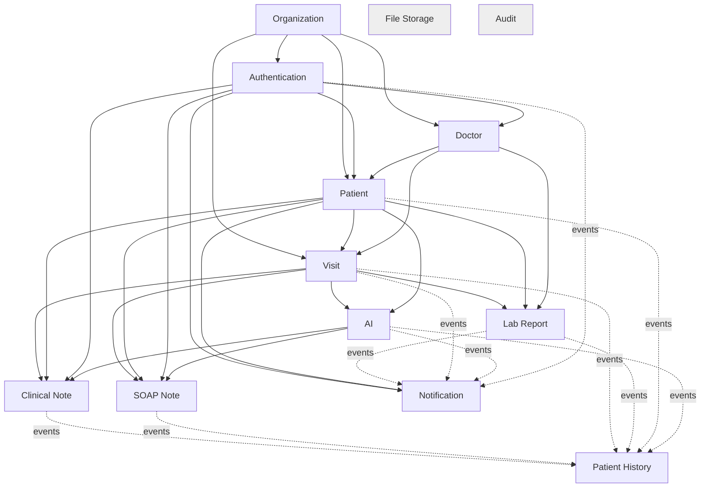
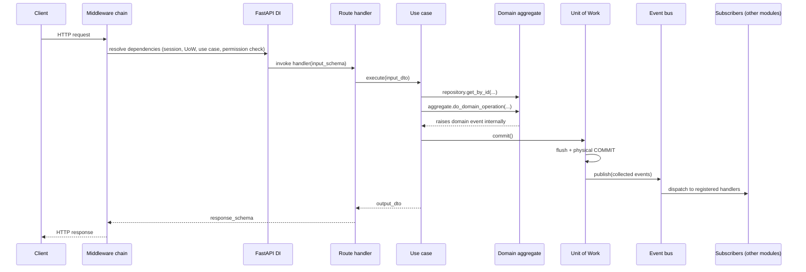

# Dependency Injection, Dependency Graph, Middleware & Request Lifecycle

## Dependency Injection structure

Two composition mechanisms, working at two different lifetimes — deliberately not one framework for both, because process-lifetime singletons (a DB engine) and request-lifetime objects (a use case bound to this request's session and user) have genuinely different construction rules:

### 1. Process-lifetime singletons — `app/core/container.py`

Built once, inside `app/main.py`'s `lifespan` context manager (the pattern
already established in the Turn 1 scaffold), and attached to `app.state`:
the DB engine/session factory, the Redis client, the Qdrant client, the
MinIO client, the raw AI provider SDK clients, the `EventBus` instance, and
each module's `container.py` (below). These are expensive to construct
(connection pools) and hold no per-request state, so they are built
exactly once and shared.

### 2. Module-level composition — `app/modules/<name>/container.py`

Each module has one `container.py` that is the **only place** its
interfaces get bound to implementations: `PatientRepository` (interface,
from `domain/`) → `SqlAlchemyPatientRepository` (implementation, from
`infrastructure/`); the module's `public/facade.py` → wired with the
concrete use case instances it fronts. A module's `container.py` is built
once at startup (registered into `app/core/container.py`), taking the
process-lifetime singletons it needs (engine, redis, etc.) as inputs, and
exposes factory functions for request-scoped objects (below) — it does not
itself hold request state.

### 3. Request-lifetime objects — FastAPI `Depends()`

Per-request objects — the `AsyncSession` for this request, the
`UnitOfWork` wrapping it, a fully-constructed use case with that UoW and
its repositories injected — are provided via FastAPI's dependency
injection, chained through `app/api/deps.py` (existing:
`get_db_session`) and each module's `api/dependencies.py`. A dependency
provider function's entire job is: pull the relevant process-lifetime
singleton from `request.app.state` (or a module container), construct the
request-scoped pieces, and `yield` the fully-wired use case. This is what
keeps route handlers (when implemented) to the three-line shape described
in `02_layer_responsibilities.md` — all wiring happens in `dependencies.py`,
never inline in a route.

**Why not a third-party DI container library:** FastAPI's `Depends()`
already provides request-scoped resolution with automatic cleanup
(`yield`-style dependencies), and the module `container.py` files provide
explicit, readable singleton wiring without a framework's magic. A
library like `dependency-injector` becomes worth adopting if the number of
cross-cutting provider combinations grows unmanageable — noted here as the
scaling option, not adopted preemptively.

**Lifetime summary:**

| Object | Lifetime | Constructed by |
|---|---|---|
| DB engine, Redis/Qdrant/MinIO clients, AI SDK clients, `EventBus` | Process (once) | `app/main.py` `lifespan`, via `app/core/container.py` |
| Module `container.py` (interface→implementation bindings) | Process (once) | `app/core/container.py`, at startup |
| `AsyncSession`, `UnitOfWork`, repositories, a constructed use case | Request (per call) | `app/api/deps.py` + module `api/dependencies.py`, via `Depends()` |
| Domain entities, DTOs | Operation (created and discarded within one use case execution) | The use case itself |

---

## Middleware (applied, in order, to every request)

| Order | Middleware | Responsibility | Why this position |
|---|---|---|---|
| 1 | `CORSMiddleware` | Browser cross-origin policy | Must run before anything else can reject the request, including preflight `OPTIONS` |
| 2 | `TrustedHostMiddleware` | Reject requests with an unexpected `Host` header | Cheap rejection, before any real work |
| 3 | `RequestIDMiddleware` | Generate/propagate `X-Request-ID`, bind into logging context | Every subsequent middleware and handler should be able to log with this ID |
| 4 | `LoggingMiddleware` | Structured access log (method, path, status, duration) | Wraps everything inward so duration includes true end-to-end time |
| 5 | `TenantContextMiddleware` *(new)* | Decode the JWT (if present), resolve `organization_id`/`user_id`, bind into `contextvars` (`app/shared/infrastructure/tenant_context.py`) | Must run before the DB session dependency, which reads this context to issue `SET LOCAL app.current_organization_id` (`../database/00_overview.md`) |
| — | *(Authentication enforcement is a `Depends()`, not middleware)* | — | Not every route requires auth (health check, login) — a global middleware can't express "except these routes" as cleanly as an opt-in dependency; see `07_security_layer.md` |
| 6 | `ErrorHandlerMiddleware` / exception handlers | Translate `AppError` subclasses (and anything unhandled) into the standard JSON error shape | Registered as FastAPI exception handlers (existing pattern), effectively the innermost wrapper around route execution |

This extends, rather than replaces, the middleware stack already
implemented in the Turn 1 scaffold (`app/middlewares/`); only
`TenantContextMiddleware` is new.

---

## Dependency graph

### Layer-level (applies inside every module — see `00_architectural_principles.md`)

### Module-level (the 13 bounded contexts — full detail in `03_module_architecture.md`)

Solid arrows are compile-time `public/` interface dependencies (allowed
imports). Dashed arrows are event subscriptions (no import dependency at
all — see `10_module_communication.md`). `File Storage` and `Audit` are
depended on by many modules (omitted above for readability) but depend on
nothing themselves — they are drawn unconnected to emphasize that no
arrow ever points *into* them from `domain/`/`application/` imports in the
other direction.

**No cycles exist in the solid-arrow graph.** This is verified in CI, not
just asserted — see `11_standards_and_conventions.md`.

---

## Request lifecycle

Numbered walk-through of one authenticated write request (e.g. "record a
patient allergy") from socket to response:

1. **ASGI server** (Uvicorn/Gunicorn) accepts the connection and hands the
   request to the FastAPI app.
2. **Middleware chain executes**, outermost first: CORS/TrustedHost checks,
   `RequestIDMiddleware` generates a correlation ID, `LoggingMiddleware`
   starts a timer, `TenantContextMiddleware` decodes the JWT and binds
   `(organization_id, user_id)` into request-scoped `contextvars`.
3. **FastAPI resolves the route's dependency tree**, depth-first: this
   pulls `get_db_session()` (opens an `AsyncSession`), which the
   `UnitOfWork` dependency wraps, which the module's use-case dependency
   provider (`api/dependencies.py`) uses to construct
   `RecordAllergy(patient_repository=..., unit_of_work=...)` with the
   concrete repository bound via that module's `container.py`.
4. **A permission-check dependency runs** (`require_permission("patients.write")`,
   `07_security_layer.md`), calling Authentication's
   `PermissionCheckPort` — if it fails, a `ForbiddenError` short-circuits
   here, before any handler code runs.
5. **Pydantic validates** the request body against the module's
   `api/schemas.py` model (Tier 1 validation,
   `04_repository_and_service_patterns.md`) — a malformed request never
   reaches the use case.
6. **The route handler runs** (three lines, per
   `02_layer_responsibilities.md`): map the validated request schema to
   the use case's Input DTO, call `use_case.execute(input_dto)`, map the
   Output DTO to a response schema.
7. **Inside the use case:** load the `Patient` aggregate via
   `PatientRepository.get_by_id` (Tier 2 validation happens here — does
   this patient exist, in this organization); call
   `patient.record_allergy(...)` (Tier 3 validation happens here, inside
   the entity); the entity records a `PatientAllergyRecorded` domain event
   on itself.
8. **`UnitOfWork.commit()`** flushes the SQLAlchemy session (persisting the
   change), commits the physical transaction, then — only after that
   commit succeeds — collects the domain event(s) recorded on any touched
   aggregate and hands them to the `EventBus`.
9. **`EventBus.publish(PatientAllergyRecorded)`** synchronously invokes
   any in-process subscribers registered for that event type — e.g.
   Patient History's projection handler runs inline here (fast, DB-local
   write); Notification's handler, if any, typically just **enqueues a
   Celery task** rather than doing slow I/O (an email API call) inline in
   the request path — see `08_background_workers.md`.
10. **The response schema is serialized** (ORJSON, per the existing
    `app/schemas/base.py` convention) and returned up through the
    middleware chain.
11. **`LoggingMiddleware` logs** the completed request (status, duration);
    the response is sent to the client.
12. **If any step from 6–9 raised** an `AppError` subclass, the registered
    exception handler (`app/middlewares/error_handler.py`, existing)
    converts it to the standard JSON error shape at this point instead of
    step 10 — the transaction was already rolled back by the `UnitOfWork`'s
    `__aexit__` before the exception propagated past step 8.

