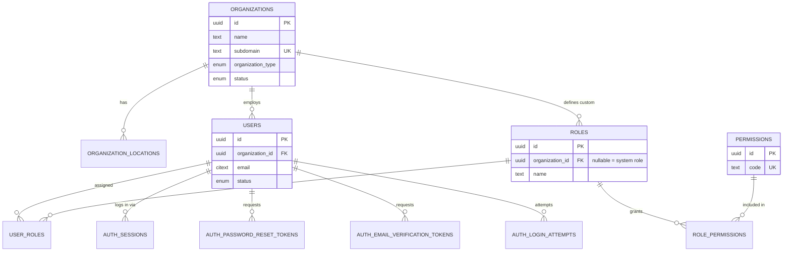
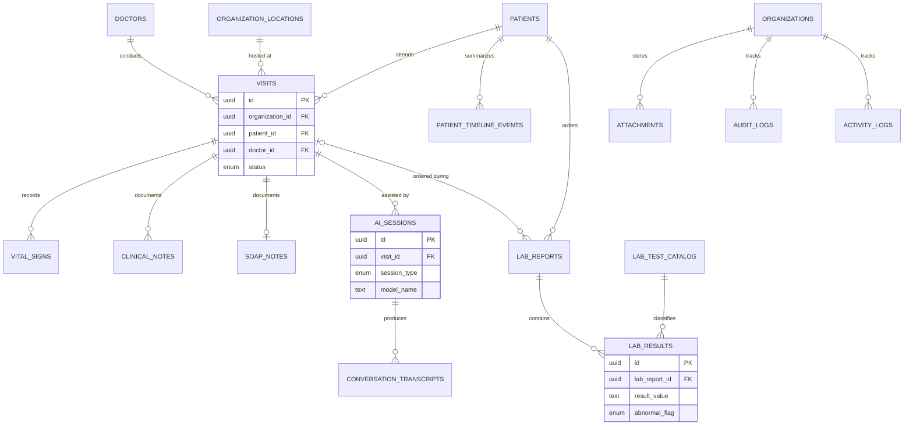

# DrAssist — Database Architecture Overview

This document set is the authoritative schema design for DrAssist's PostgreSQL
database. It covers 22 functional modules, 33 tables, multi-tenant isolation,
naming conventions, and operational strategy. **No application or API code is
included** — this is schema and DDL only. See [`../ARCHITECTURE.md`](../ARCHITECTURE.md)
for the Clean Architecture layering these tables plug into.

## Document map

| File | Contents |
|---|---|
| `00_overview.md` | This file — ERD, relationships, multi-tenancy, naming, enum catalog |
| `01_identity_and_access.md` | Modules 1–4: Authentication, Organizations, Users, RBAC |
| `02_clinical_master_data.md` | Modules 5–10: Doctors, Patients, Contacts, Allergies, Medications, Conditions |
| `03_encounters.md` | Modules 11–14: Visits, Vital Signs, Clinical Notes, SOAP Notes |
| `04_ai_features.md` | Modules 15–17: AI Sessions, Conversation Transcripts, Patient Timeline |
| `05_labs_and_attachments.md` | Modules 18–20: Lab Reports, Lab Results, Attachments |
| `06_audit_and_activity.md` | Modules 21–22: Audit Logs, Activity Logs |
| `07_sqlalchemy_structure.md` | SQLAlchemy model folder structure |
| `08_migration_strategy.md` | Alembic migration strategy |
| `09_best_practices_and_performance.md` | Database best practices & performance tuning |

## Design targets

- **PostgreSQL 16+** (uses `gen_random_uuid()` built-in since PG13, generated
  columns, partial/expression indexes, native `JSONB`, `tsvector`).
- **UUID primary keys everywhere** — no `SERIAL`/`BIGSERIAL` integer IDs,
  including on join tables (see [Naming Conventions](#naming-conventions) for
  the rationale).
- **Multi-tenant** — one shared database/schema, tenant isolation enforced by
  `organization_id` + Row-Level Security (RLS).
- **Normalized to 3NF** for transactional tables, with deliberate, documented
  denormalization only where it materially helps hot-path queries (called out
  per table).
- **AI-ready** — tables that will feed retrieval-augmented generation carry a
  nullable `embedding_id` pointing to a Qdrant point ID, and AI-authored
  clinical content carries provenance/review fields so a clinician always
  remains the human-in-the-loop of record.

---

## Entity-Relationship Diagram

The full schema is presented as three linked diagrams for readability:
identity/access, clinical/master data, and encounters/AI/labs/audit.

### 1. Identity, Tenancy & Access Control



### 2. Clinical Master Data

```mermaid
erDiagram
    ORGANIZATIONS ||--o{ DOCTORS : employs
    USERS ||--o| DOCTORS : "is a"
    ORGANIZATIONS ||--o{ PATIENTS : registers
    USERS |o--o| PATIENTS : "optional portal login"
    PATIENTS ||--o{ PATIENT_CONTACTS : has
    PATIENTS ||--o{ PATIENT_ALLERGIES : has
    PATIENTS ||--o{ PATIENT_MEDICATIONS : has
    PATIENTS ||--o{ PATIENT_CONDITIONS : has
    DOCTORS ||--o{ DOCTOR_SPECIALTIES : has
    SPECIALTIES ||--o{ DOCTOR_SPECIALTIES : "categorizes"
    CONDITION_CODES ||--o{ PATIENT_CONDITIONS : classifies
    DOCTORS ||--o{ PATIENT_MEDICATIONS : prescribes

    PATIENTS {
        uuid id PK
        uuid organization_id FK
        text medical_record_number
        date date_of_birth
    }
    DOCTORS {
        uuid id PK
        uuid organization_id FK
        uuid user_id FK UK
        text license_number
    }
```

### 3. Encounters, AI, Labs & Audit



> Polymorphic associations (`attachments.owner_id`, `patient_timeline_events.source_id`)
> are intentionally **not** drawn as FK lines — see [Relationship Explanation](#relationship-explanation).

---

## Relationship explanation

**Tenancy backbone.** `organizations` is the tenant root. Every operational
table carries a direct `organization_id` foreign key — it is **never**
inferred transitively through a parent (e.g. `vital_signs` has its own
`organization_id`, not just a derivable one via `visits → patients`). This is
deliberate: it lets every table enforce Row-Level Security independently and
lets every index start with the tenant column without an extra join.

**Identity vs. role.** `users` is the single authentication identity per
organization. `doctors` and (optionally) `patients` are *role extensions* of
`users` via a 1:1 (`doctors.user_id`) or optional 1:1 (`patients.user_id`,
nullable — most patients never log in) foreign key. This avoids duplicating
auth/profile fields and lets a single person's login govern multiple
capabilities without denormalizing name/email/phone into every role table.

**RBAC.** `permissions` is a global, non-tenant catalog of capability strings
(seeded by migration, not by tenant admins). `roles` supports two flavors via
a nullable `organization_id`: system-defined templates (`organization_id IS
NULL`, e.g. "Doctor", "Front Desk") that ship with the product, and
tenant-authored custom roles. `role_permissions` and `user_roles` are
many-to-many join tables. A user's *effective* permission set is the union of
permissions across all roles assigned via `user_roles`.

**Clinical spine.** `visits` is the central encounter entity: it binds
`patients` + `doctors` + `organization_locations` + a time window. Almost
everything clinical hangs off a visit: `vital_signs`, `clinical_notes`,
`soap_notes`, `ai_sessions`, and (optionally) `lab_reports`. Patient-level
longitudinal data that is **not** visit-bound — `patient_allergies`,
`patient_medications`, `patient_conditions`, `patient_contacts` — attaches
directly to `patients`, because allergies and chronic conditions outlive any
single encounter.

**AI provenance.** `ai_sessions` represents one AI-assisted interaction
(ambient scribe, transcription, summarization). It produces zero or more
`conversation_transcripts` (turn-level, timestamped, speaker-diarized). Any
clinical artifact an AI session helps produce (`soap_notes`, `clinical_notes`)
carries `is_ai_generated`, `ai_session_id`, `review_status`, `reviewed_by`,
and `reviewed_at` — content is never treated as authoritative in the medical
record until a clinician reviews it. `embedding_id` columns are nullable
pointers to a Qdrant point ID (Qdrant, not Postgres, is the vector store per
the platform's tech stack — see `../ARCHITECTURE.md`); Postgres stores the
reference, not the vector.

**Patient timeline.** `patient_timeline_events` is a derived, append-only
feed table. It uses a **loose polymorphic reference**
(`source_table` + `source_id`, no DB-level FK) rather than nullable FK columns
to every possible source table, because the set of event-producing tables
will grow. The trade-off — no referential integrity on `source_id` — is
deliberate and documented in `09_best_practices_and_performance.md`; the row
is populated transactionally alongside its source event (application-level
outbox or trigger), and `metadata JSONB` carries a denormalized snapshot so
the timeline UI never needs to join back to the source table at all.

**Attachments.** `attachments` is a single polymorphic file table
(`owner_type` + `owner_id`) shared by patients, visits, lab reports, clinical
notes, and SOAP notes, backed by MinIO object storage. Same trade-off as the
timeline table: no DB-level FK on `owner_id`, validated at the application
boundary and via a `CHECK` constraint restricting `owner_type` to a known
enum.

**Audit vs. activity.** These answer two different compliance questions.
`audit_logs` answers "what **data** changed, from what to what, and who
changed it" (field-level diff, populated by trigger — see module doc).
`activity_logs` answers "who **accessed or acted on** what" (logins, record
views, exports, prints) — the HIPAA "access log" requirement, which matters
even when no data was modified (e.g., a nurse viewing a patient chart).

---

## Multi-tenant strategy

**Model: shared database, shared schema, row-level isolation.**

| Strategy | Isolation | Ops cost | Cross-tenant analytics | Chosen? |
|---|---|---|---|---|
| Database-per-tenant | Strongest | Very high (N databases to patch/backup/migrate) | Hard | No — doesn't scale past dozens of tenants |
| Schema-per-tenant | Strong | High (N schemas; migrations run N times) | Hard | No — operationally heavy past hundreds of tenants |
| **Shared schema + `organization_id` + RLS** | Strong (DB-enforced) | Low (one schema, one migration path) | Easy | **Yes** |

Rationale: DrAssist expects hundreds to thousands of clinics/hospitals. A
single shared schema with Postgres **Row-Level Security (RLS)** gives
per-tenant isolation enforced *at the database engine*, not just in
application code — a query that forgets a `WHERE organization_id = ...`
clause still cannot leak another tenant's rows. This is the industry-standard
pattern for multi-tenant healthcare SaaS at this scale.

### Enforcement mechanism

1. Every tenant-scoped table has a `NOT NULL organization_id UUID REFERENCES
   organizations(id)` column (see per-table specs).
2. RLS is enabled and forced on every such table:

```sql
ALTER TABLE patients ENABLE ROW LEVEL SECURITY;
ALTER TABLE patients FORCE ROW LEVEL SECURITY; -- applies even to the table owner role

CREATE POLICY tenant_isolation ON patients
    USING (organization_id = current_setting('app.current_organization_id', true)::uuid)
    WITH CHECK (organization_id = current_setting('app.current_organization_id', true)::uuid);
```

3. The application sets a session-local GUC **per transaction**, not per
   connection (connections are pooled and reused across tenants):

```sql
SET LOCAL app.current_organization_id = '3fa85f64-5717-4562-b3fc-2c963f66afa6';
```

   In SQLAlchemy this is done via a `before_cursor_execute`/session-begin hook
   that issues `SET LOCAL` at the start of every transaction, sourced from the
   authenticated request's tenant claim (JWT). Using `SET LOCAL` (transaction
   scope) rather than `SET` (session scope) is essential under connection
   pooling (PgBouncer transaction mode or SQLAlchemy's pool) — it guarantees
   the setting cannot leak into the next request that reuses the connection.
4. The database role the application connects as must **not** have
   `BYPASSRLS`, and superuser/owner access is reserved for migrations only.
5. Global/reference tables (`permissions`, `specialties`, `condition_codes`,
   `lab_test_catalog`) have **no** `organization_id` and **no** RLS — they are
   shared, read-mostly catalogs.

### Platform administration (out of module scope, noted for completeness)

DrAssist's own internal staff (support, platform ops) need cross-tenant
access for support tooling. This is **not** modeled as a `users` row with a
special flag inside a tenant — mixing platform-operator identity into
tenant-scoped `users` would require every tenant-facing query to special-case
it and would weaken the RLS guarantee. Recommended approach (not detailed as
a module here): a separate, non-RLS `platform_admins` table outside the
tenant boundary, with all cross-tenant access mediated by an audited internal
tool that explicitly sets `app.current_organization_id` per action and logs
it to `audit_logs`.

---

## Naming conventions

| Element | Convention | Example |
|---|---|---|
| Tables | `snake_case`, plural | `patients`, `lab_results` |
| Columns | `snake_case`, singular | `first_name`, `medical_record_number` |
| Primary key | Always `id UUID` | `id UUID PRIMARY KEY DEFAULT gen_random_uuid()` |
| Foreign key column | `<referenced_singular_table>_id` | `patient_id`, `organization_id`, `doctor_id` |
| Join/junction tables | `<table_a_singular>_<table_b_singular>` | `role_permissions`, `user_roles`, `doctor_specialties` |
| Boolean columns | `is_`/`has_` prefix | `is_active`, `is_ai_generated`, `has_portal_access` |
| Timestamp columns | `_at` suffix, always `TIMESTAMPTZ` | `created_at`, `resolved_at`, `scheduled_start_at` |
| Date-only columns | `_date` suffix, `DATE` type | `date_of_birth`, `onset_date` |
| Enum types | `<entity>_<column>_enum` | `visit_status_enum`, `allergy_severity_enum` |
| Indexes | `ix_<table>_<column(s)>` | `ix_visits_organization_id_scheduled_start_at` |
| Unique constraints | `uq_<table>_<column(s)>` | `uq_users_organization_id_email` |
| Check constraints | `ck_<table>_<rule>` | `ck_vital_signs_pain_score_range` |
| Foreign key constraints | `fk_<table>_<column>_<ref_table>` | `fk_visits_patient_id_patients` |

**Why every table — including pure join tables — gets its own `id UUID`
primary key** rather than a composite `(a_id, b_id)` primary key: it gives
every row in the database a single, stable, opaque identifier that
`audit_logs.record_id` and `attachments.owner_id`-style polymorphic
references can point to uniformly, without a special case for join tables.
The natural key is still enforced via an explicit `UNIQUE(a_id, b_id)`
constraint, so no duplicate-mapping risk is introduced.

**Why `TEXT` instead of `VARCHAR(n)`:** In PostgreSQL, `TEXT` and
`VARCHAR` share the same internal representation and performance
characteristics — `VARCHAR(n)` only adds a length check. Arbitrary length
caps on names/addresses/free text are a frequent source of avoidable
production incidents; where a real bounded format exists (e.g. a 2-letter
country code), a `CHECK` constraint or `CHAR(n)` is used instead of a
length-limited `VARCHAR`.

**Why `TIMESTAMPTZ` everywhere:** `TIMESTAMP WITHOUT TIME ZONE` silently
discards zone information; for a healthcare platform spanning time zones
(and eventually regions), every instant is stored as `TIMESTAMPTZ` (UTC on
disk) and converted at the presentation layer. `DATE` is used only for
values that are genuinely calendar dates with no time component
(`date_of_birth`).

---

## Enum catalog

All enums are defined as native PostgreSQL `CREATE TYPE ... AS ENUM`, created
in a dedicated Alembic migration before any table that uses them (see
`08_migration_strategy.md`). Full definitions appear alongside the table that
owns each enum; this is the master index.

| Enum type | Defined in | Values |
|---|---|---|
| `organization_type_enum` | 01 | `clinic`, `hospital`, `diagnostic_center`, `telehealth_provider`, `other` |
| `organization_status_enum` | 01 | `trial`, `active`, `suspended`, `cancelled` |
| `location_type_enum` | 01 | `main`, `branch`, `satellite`, `telehealth` |
| `user_status_enum` | 01 | `invited`, `active`, `suspended`, `deactivated` |
| `sex_enum` | 02 | `male`, `female`, `intersex`, `unknown` |
| `blood_type_enum` | 02 | `a_positive`, `a_negative`, `b_positive`, `b_negative`, `ab_positive`, `ab_negative`, `o_positive`, `o_negative`, `unknown` |
| `marital_status_enum` | 02 | `single`, `married`, `divorced`, `widowed`, `separated`, `unknown` |
| `contact_type_enum` | 02 | `emergency`, `guardian`, `next_of_kin`, `caregiver`, `insurance` |
| `allergen_type_enum` | 02 | `medication`, `food`, `environmental`, `other` |
| `allergy_severity_enum` | 02 | `mild`, `moderate`, `severe`, `life_threatening` |
| `clinical_status_enum` | 02 | `active`, `inactive`, `resolved`, `chronic`, `in_remission` |
| `medication_route_enum` | 02 | `oral`, `intravenous`, `intramuscular`, `subcutaneous`, `topical`, `inhalation`, `other` |
| `medication_status_enum` | 02 | `active`, `discontinued`, `completed`, `on_hold` |
| `visit_type_enum` | 03 | `in_person`, `telehealth`, `phone`, `home_visit` |
| `visit_status_enum` | 03 | `scheduled`, `checked_in`, `in_progress`, `completed`, `cancelled`, `no_show` |
| `clinical_note_type_enum` | 03 | `progress`, `consultation`, `discharge_summary`, `nursing`, `referral`, `procedure`, `addendum` |
| `content_review_status_enum` | 03 | `draft`, `pending_review`, `reviewed`, `finalized`, `amended` |
| `ai_session_type_enum` | 04 | `ambient_scribe`, `transcription`, `summarization`, `coding_assist`, `differential_diagnosis`, `chat` |
| `ai_session_status_enum` | 04 | `pending`, `in_progress`, `completed`, `failed`, `cancelled` |
| `speaker_role_enum` | 04 | `doctor`, `patient`, `other_participant`, `unknown`, `system` |
| `timeline_event_type_enum` | 04 | `visit_created`, `visit_completed`, `diagnosis_added`, `medication_prescribed`, `allergy_recorded`, `lab_result_received`, `note_added`, `ai_session_completed`, `attachment_uploaded` |
| `lab_report_status_enum` | 05 | `ordered`, `collected`, `in_progress`, `resulted`, `cancelled` |
| `lab_result_status_enum` | 05 | `preliminary`, `final`, `corrected`, `cancelled` |
| `lab_abnormal_flag_enum` | 05 | `normal`, `low`, `high`, `critical_low`, `critical_high`, `abnormal` |
| `attachment_owner_type_enum` | 05 | `patient`, `visit`, `clinical_note`, `soap_note`, `lab_report`, `conversation_transcript`, `organization` |
| `virus_scan_status_enum` | 05 | `pending`, `clean`, `infected`, `scan_failed` |
| `audit_action_enum` | 06 | `insert`, `update`, `soft_delete`, `restore`, `hard_delete` |
| `activity_type_enum` | 06 | `login`, `logout`, `login_failed`, `view_patient`, `view_lab_result`, `export_data`, `print_record`, `password_change`, `permission_change`, `ai_session_started` |

> **ENUM vs. lookup table policy:** native enums are used for small, stable,
> code-owned value sets that change rarely (statuses, types). Value sets that
> are large, edited by tenants/admins, or standards-driven (medical
> specialties, ICD-10 diagnosis codes, LOINC lab tests) are modeled as proper
> **lookup tables** (`specialties`, `condition_codes`, `lab_test_catalog`)
> instead, because `ALTER TYPE ... ADD VALUE` is coarser-grained and cannot be
> done inside the same transaction that uses the new value. See
> `09_best_practices_and_performance.md` for the full trade-off discussion.

---

## Standard columns applied to every table

Per the design brief, **every** table in this schema includes:

```sql
id          UUID        PRIMARY KEY DEFAULT gen_random_uuid(),
created_at  TIMESTAMPTZ NOT NULL DEFAULT now(),
updated_at  TIMESTAMPTZ NOT NULL DEFAULT now(),
deleted_at  TIMESTAMPTZ NULL,
created_by  UUID        NULL REFERENCES users(id) ON DELETE SET NULL,
updated_by  UUID        NULL REFERENCES users(id) ON DELETE SET NULL
```

- `updated_at` is maintained by a single shared trigger function
  (`set_updated_at()`), attached `BEFORE UPDATE` on every table — see
  `08_migration_strategy.md`.
- **Soft delete**: `deleted_at IS NULL` means active. All tenant-scoped
  natural-key `UNIQUE` constraints are implemented as **partial unique
  indexes** filtered `WHERE deleted_at IS NULL`, so a reused email/MRN/etc.
  doesn't collide with a soft-deleted row.
- `created_by`/`updated_by` are nullable because some rows are system-
  generated (migrations, seed data, AI pipelines) with no human actor; both
  use `ON DELETE SET NULL` so attribution history survives even if the
  acting user account is later hard-deleted (a rare, deliberate operation).
- **Compliance-critical append-only tables** (`audit_logs`, `activity_logs`,
  `auth_login_attempts`, `conversation_transcripts`) keep all five columns
  for schema consistency, but `updated_at`/`updated_by`/`deleted_at` on these
  tables are **immutability-enforced** — see `06_audit_and_activity.md` for
  the trigger that rejects `UPDATE`/`DELETE` outright. This satisfies the
  uniform-column requirement without compromising the tamper-evidence a
  healthcare audit trail requires.

The per-table specs in the following documents show the full column list
(including these standard six) for completeness, and call out any deviation
explicitly.
